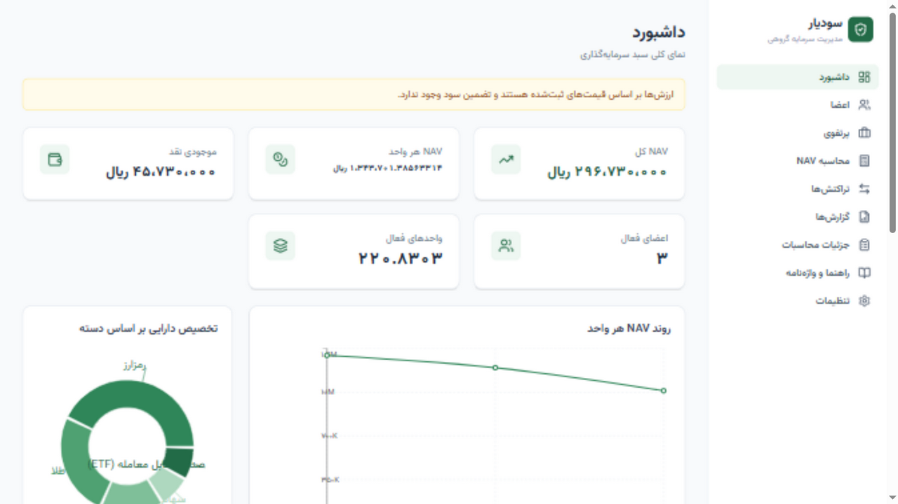
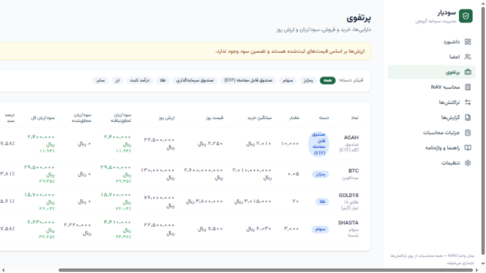
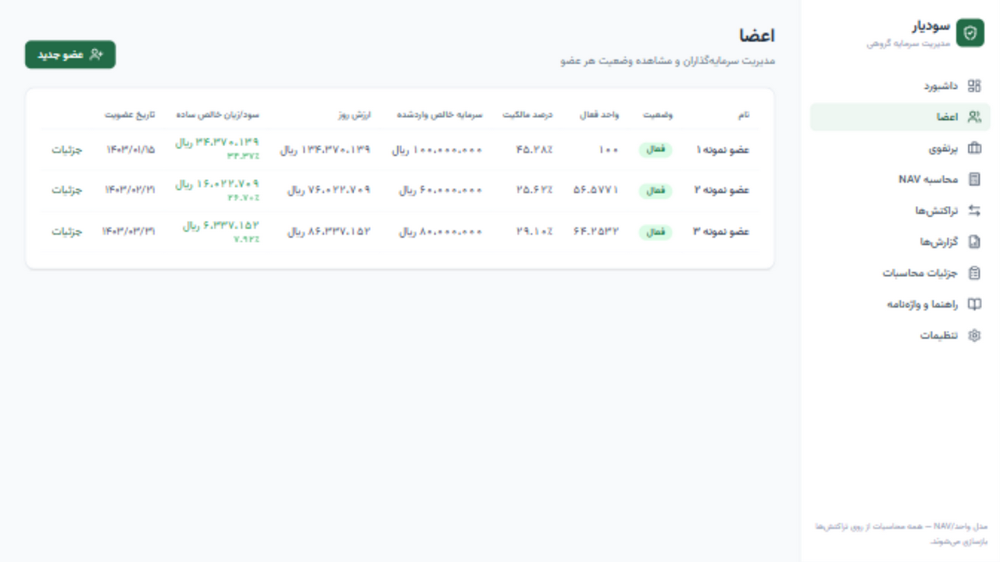
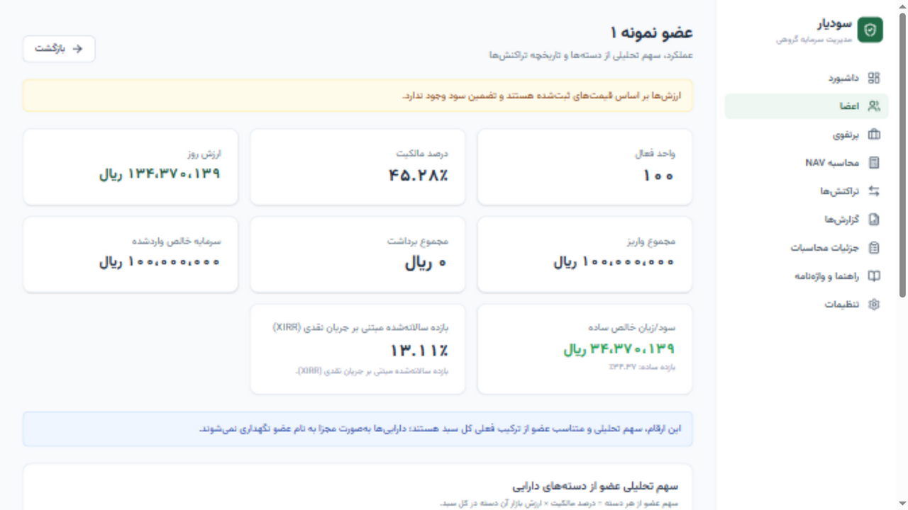
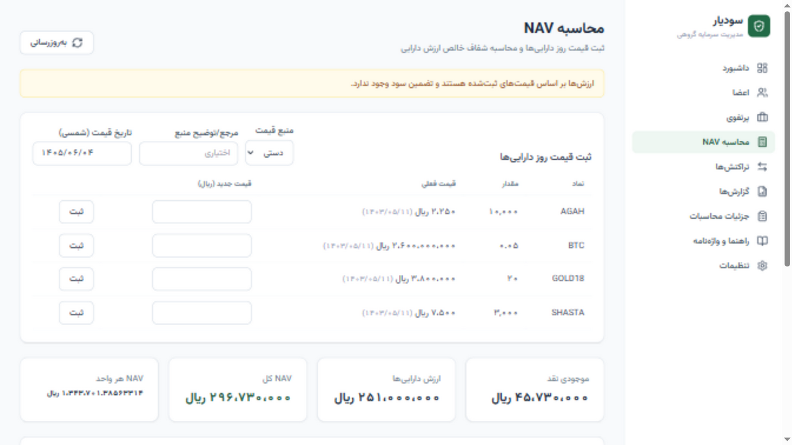
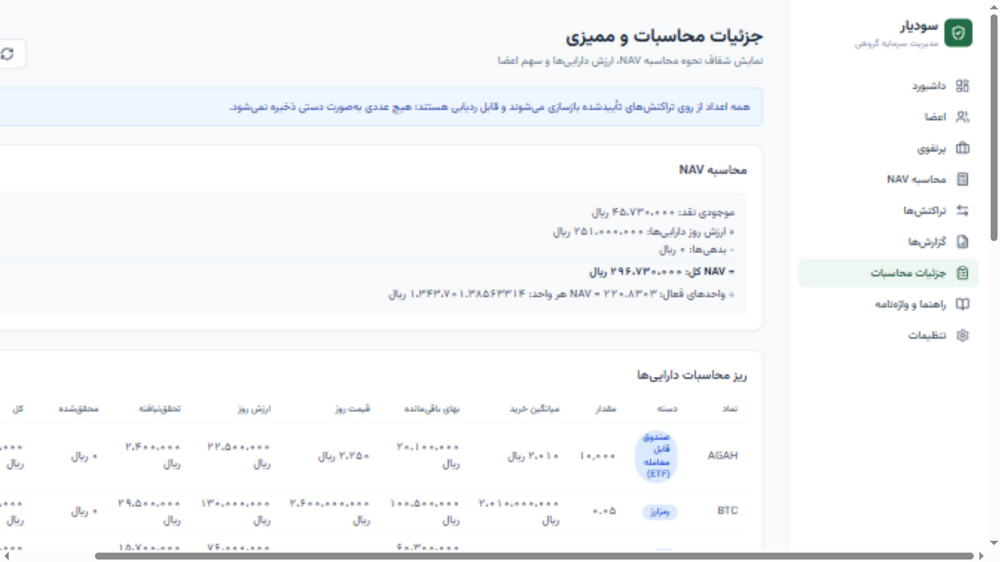
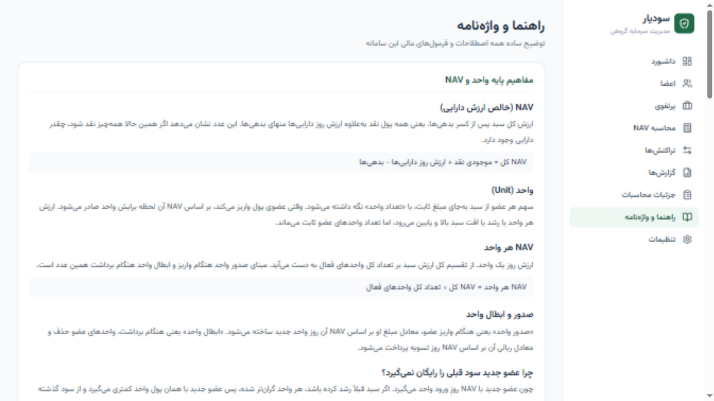
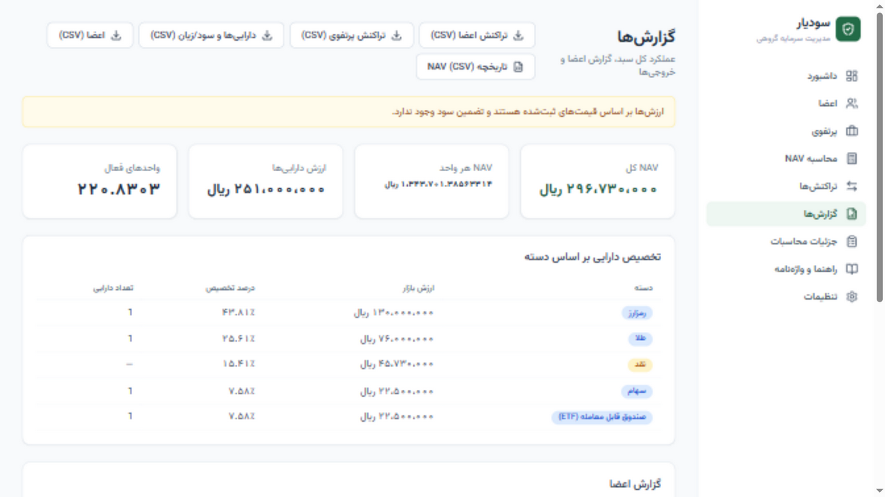
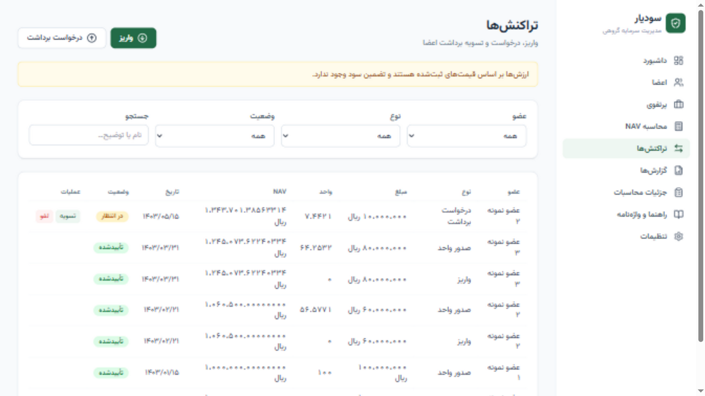

<div align="center">

# سودیار — SoodYar

**مدیریت سرمایه‌گذاری گروهی بر پایهٔ مدل واحد / NAV**

وب‌اپلیکیشن Local-first، فارسی و راست‌به‌چپ، با تاریخ‌های شمسی و محاسبات مالی دقیق (بدون float)

</div>

---

## این پروژه چیست؟

**سودیار** ابزاری است برای گروه‌هایی که سرمایهٔ خود را در یک سبد مشترک سرمایه‌گذاری می‌کنند، در حالی که اعضا در **زمان‌های مختلف** و با **مبالغ متفاوت** وارد یا خارج می‌شوند. مشکل اصلیِ چنین گروه‌هایی این است که «درصد ثابت از سرمایهٔ اولیه» عادلانه نیست؛ چون ارزش سبد در طول زمان تغییر می‌کند.

سودیار این مشکل را با **مدل واحد / NAV** (همان مدلی که صندوق‌های سرمایه‌گذاری استفاده می‌کنند) حل می‌کند: هر بار که کسی پول وارد می‌کند، به‌اندازهٔ ارزش روزِ واحد، برایش **واحد** صادر می‌شود. سود و زیان به‌نسبت واحدهای هر عضو تقسیم می‌شود — منصفانه و شفاف.

> ⚠️ ارزش‌ها بر اساس قیمت‌های ثبت‌شده هستند و تضمین سود وجود ندارد.

---

## نمایی از برنامه

### داشبورد
نمای کلی سبد: NAV کل، NAV هر واحد، موجودی نقد، اعضای فعال، واحدهای فعال، نمودار روند NAV و تخصیص دارایی بر اساس دسته.



### پرتفوی (دارایی‌ها)
دارایی‌ها با میانگین قیمت خرید، ارزش روز، سود/زیان محقق‌نشده و محقق‌شده، وزن هر دارایی و موقعیت‌های بسته‌شده.



### اعضا
لیست اعضا با درصد مالکیت، سرمایهٔ خالص واردشده، ارزش روز و سود/زیان خالص ساده.



### جزئیات عضو
عملکرد تحلیلی هر عضو: سرمایهٔ واردشده، سود/زیان خالص ساده، بازده سالانه‌شده مبتنی بر جریان نقدی (XIRR) و سهم تحلیلی از دسته‌های دارایی.



### محاسبهٔ NAV
ثبت قیمت روز دارایی‌ها (با منبع قیمت)، محاسبهٔ شفاف NAV و ثبت NavSnapshot با تاریخ شمسی.



### جزئیات محاسبات (Audit)
شکست کامل محاسبهٔ NAV، جزئیات هر دارایی، تخصیص دسته‌ها، سهم اعضا و لاگ حسابرسی — همه‌چیز قابل بازسازی و ردیابی.



### راهنما و واژه‌نامه
توضیح سادهٔ همهٔ اصطلاحات مالی (NAV، واحد، میانگین قیمت خرید، سود محقق‌شده/نشده، XIRR و …) به زبان فارسی روان.



### گزارش‌ها و تراکنش‌ها

<div align="center">


</div>

---

## ویژگی‌های کلیدی

- 📊 **مدل واحد / NAV** — تقسیم عادلانهٔ سود/زیان بین اعضایی که در زمان‌های مختلف وارد شده‌اند
- 🧮 **محاسبات دقیق بدون float** — مبالغ ریالی به‌صورت عدد صحیح (BigInt) و واحد/NAV با Decimal ۸ رقم اعشار
- 🔍 **کاملاً قابل بازسازی (Audit-friendly)** — همهٔ اعداد از روی لجر تراکنش‌ها بازسازی می‌شوند
- 📈 **سود/زیان دارایی‌ها** — میانگین موزون قیمت خرید (WAC)، سود محقق‌شده و محقق‌نشده
- 👤 **عملکرد هر عضو** — سود/زیان خالص ساده و XIRR (بازده مبتنی بر جریان نقدی)
- 🗂 **دسته‌بندی دارایی** — رمزارز، سهام، ETF، صندوق، طلا، درآمد ثابت، ارز، نقد و …
- 📅 **تاریخ شمسی (جلالی)** در همهٔ ورودی‌ها و نمایش‌ها
- 🌐 **فارسی و RTL** با رابط کاربری تمیز و ریسپانسیو
- 💾 **بکاپ/بازیابی** و خروجی CSV/Excel با پشتیبانی درست از فارسی
- 🏠 **Local-first** روی SQLite، آمادهٔ مهاجرت به PostgreSQL

---

## فناوری‌ها

| لایه | فناوری |
|------|--------|
| Frontend | React + Vite + TypeScript + Tailwind CSS + Recharts |
| Backend | Node.js + Fastify + TypeScript |
| Database | SQLite (نسخهٔ اول) — آمادهٔ مهاجرت به PostgreSQL |
| ORM | Prisma |
| اعتبارسنجی | Zod |
| تست | Vitest |

ساختار **monorepo** با npm workspaces: پکیج `server` (API) و پکیج `web` (رابط کاربری) کاملاً از هم جدا هستند.

---

## مدل مالی (خلاصهٔ قوانین)

1. هر عضو تعداد مشخصی **واحد** دارد.
2. `totalNav = cashBalance + totalMarketValueOfAssets − liabilities`
3. `navPerUnit = totalNav / totalActiveUnits`
4. ورود سرمایه: `issuedUnits = netDepositAmount / navPerUnit`
5. خروج سرمایه: `withdrawalAmount = redeemedUnits × navPerUnit`
6. ارزش روز عضو: `memberValue = activeUnits × currentNavPerUnit`
7. درصد مالکیت: `ownershipPercent = activeUnits / totalActiveUnits × 100`
8. اگر هنوز واحدی صادر نشده باشد، NAV هر واحد قابل تنظیم است (پیش‌فرض ۱٬۰۰۰٬۰۰۰ ریال).
9. **بدون float**: مبالغ ریالی به‌صورت عدد صحیح (BigInt) و واحدها/NAV به‌صورت Decimal با ۸ رقم اعشار ذخیره می‌شوند.
10. تراکنش‌های تأییدشده **حذف نمی‌شوند**؛ لغو/اصلاح با تغییر `status` یا تراکنش معکوس انجام می‌شود.
11. همهٔ محاسبات audit-friendly، تاریخ‌دار و از روی لجر تراکنش‌ها **قابل بازسازی** هستند.

### سود/زیان دارایی‌ها

- **میانگین موزون قیمت خرید (WAC)**: کارمزد خرید در بهای تمام‌شده لحاظ می‌شود.
- **سود محقق‌نشده** = ارزش روز − باقیماندهٔ بهای تمام‌شده
- **سود محقق‌شده** = (وجه فروش − کارمزد) − بهای تمام‌شدهٔ واحدهای فروخته‌شده

### عملکرد هر عضو — دو معیار مکمل

| معیار | تعریف | محدودیت |
|-------|-------|---------|
| **سود/زیان خالص ساده** | `ارزش روز − سرمایهٔ خالص واردشده` | زمان‌بندی جریان نقدی را در نظر نمی‌گیرد |
| **XIRR** | بازده سالانه‌شدهٔ مبتنی بر زمان و مبلغ هر جریان نقدی | حساس به تاریخ‌ها؛ برای مقایسهٔ عملکرد دقیق‌تر است |

> «سود/زیان خالص ساده» فقط تفاوت ارزش روز و سرمایهٔ واردشده را نشان می‌دهد و به این‌که پول **کِی** وارد شده کاری ندارد. **XIRR** همان بازده را با درنظرگرفتن زمان‌بندی جریان‌های نقدی سالانه می‌کند. XIRR صرفاً یک معیار تحلیلی است و هرگز در محاسبهٔ هستهٔ واحد/NAV دخالت نمی‌کند.

توابع مالی هستهٔ سیستم در `server/src/lib/money.ts` قرار دارند و برای همهٔ آن‌ها تست واحد نوشته شده است (`server/src/lib/money.test.ts`).

> **توجه دربارهٔ مالکیت اعضا:** ارقام سهم هر عضو، سهم **تحلیلی و متناسب** از ترکیب فعلی کل سبد هستند؛ دارایی‌ها به‌صورت مجزا به نام عضو نگهداری نمی‌شوند.

---

## پیش‌نیازها

- Node.js نسخهٔ ۲۰ یا بالاتر
- npm نسخهٔ ۱۰ یا بالاتر

---

## نصب و راه‌اندازی

### روش سریع (ویندوز) — پیشنهادی برای استفادهٔ شخصی

فقط کافی است روی فایل **`start.bat`** دابل‌کلیک کنید. این فایل بار اول به‌صورت خودکار وابستگی‌ها را نصب، پایگاه‌داده را می‌سازد و برنامه را اجرا می‌کند؛ سپس مرورگر روی `http://localhost:5300` باز می‌شود. دفعات بعد فقط برنامه را بالا می‌آورد و **همهٔ داده‌های شما حفظ می‌شود** (در فایل SQLite محلی).

برای شروع دوباره از صفر (پاک‌کردن همهٔ داده‌ها) روی **`reset-data.bat`** دابل‌کلیک کنید.

### روش دستی (همهٔ سیستم‌عامل‌ها)

```bash
# ۱) نصب وابستگی‌ها (از ریشهٔ پروژه — هر دو workspace نصب می‌شوند)
npm install

# ۲) پیکربندی محیط
cp .env.example server/.env

# ۳) ساخت پایگاه‌داده و تولید Prisma Client
npm run db:setup

# ۴) بارگذاری دادهٔ نمونه (اختیاری، برای دیدن برنامه با داده)
npm run db:seed

# ۵) اجرا (توسعه)
npm run dev
```

- API روی `http://localhost:4000`
- رابط کاربری روی `http://localhost:5300`

Vite درخواست‌های `/api` را به‌صورت proxy به سرور می‌فرستد.

> دادهٔ نمونه شامل ۳ عضو با نام‌های ناشناس، چند واریز در NAVهای متفاوت، چند دارایی (طلا، سهام، رمزارز، ETF)، قیمت‌های روز، خرید/فروش/سود نقدی/کارمزد، چند NavSnapshot و یک درخواست برداشت در انتظار است. **هیچ دادهٔ واقعی یا شخصی در مخزن وجود ندارد.**

---

## اجرای بخش‌ها به‌صورت جداگانه

```bash
npm run dev:server     # فقط API
npm run dev:web        # فقط رابط کاربری
npm run test           # تست‌های واحد توابع مالی
npm run build          # build سرور و وب
npm run start          # اجرای سرور build‌شده (پس از build)
npm run db:seed        # بارگذاری دادهٔ نمونه
npm run db:reset       # پاک‌کردن همهٔ داده‌ها و بازگشت تنظیمات به پیش‌فرض
```

### اجرا با Docker (اختیاری)

```bash
docker compose up --build
```

سرویس `server` هنگام اجرا به‌صورت خودکار پایگاه‌داده را می‌سازد، seed می‌کند و API را بالا می‌آورد.

---

## بکاپ، بازیابی و خروجی

- **بکاپ**: از صفحهٔ تنظیمات یا `POST /api/backup` — یک کپی زمان‌دار از SQLite در `server/backups/`.
- **بازیابی**: سرور را متوقف کنید، فایل بکاپ را جایگزین `server/prisma/dev.db` کنید و دوباره اجرا کنید.
- **خروجی CSV/Excel** (با BOM یونیکد برای نمایش درست فارسی در Excel):
  - `GET /api/reports/export/member-transactions.csv`
  - `GET /api/reports/export/portfolio-transactions.csv`
  - `GET /api/reports/export/portfolio-assets.csv`
  - `GET /api/reports/export/members.csv`
  - `GET /api/reports/export/nav-history.csv`

---

## مهاجرت به PostgreSQL (آینده)

۱. در `server/prisma/schema.prisma` مقدار `provider` را به `postgresql` تغییر دهید.
۲. متغیر `DATABASE_URL` را روی رشتهٔ اتصال Postgres تنظیم کنید.
۳. `npx prisma migrate dev` را اجرا کنید.

اسکیمای پایگاه‌داده عمداً از ویژگی‌های مخصوص SQLite استفاده نمی‌کند تا مهاجرت تمیز باشد.

---

## ساختار پروژه

```
SoodYar/
├─ package.json            # ریشهٔ workspaces + اسکریپت‌های سراسری
├─ docker-compose.yml
├─ .env.example
├─ docs/screenshots/       # تصاویر README
├─ server/
│  ├─ prisma/
│  │  ├─ schema.prisma     # مدل‌های دیتابیس
│  │  └─ seed.ts           # دادهٔ نمونه (ناشناس)
│  └─ src/
│     ├─ index.ts          # راه‌اندازی Fastify
│     ├─ schemas.ts        # اعتبارسنجی Zod
│     ├─ lib/money.ts      # توابع مالی (+ money.test.ts)
│     ├─ services/         # منطق کسب‌وکار (nav, memberTx, assetTx, portfolio, backup, audit)
│     └─ routes/           # اندپوینت‌های API
└─ web/
   └─ src/
      ├─ pages/            # داشبورد، اعضا، پرتفوی، NAV، تراکنش‌ها، گزارش‌ها، حسابرسی، واژه‌نامه، تنظیمات
      ├─ components/       # Layout, Modal, Toast, UI, JalaliDateInput
      ├─ context/          # تنظیمات (واحد پول)
      └─ lib/              # api client، فرمت اعداد/تاریخ شمسی، برچسب‌ها
```

### مدل‌های دیتابیس

`Member`, `Asset`, `MemberTransaction`, `PortfolioTransaction`, `PriceSnapshot`, `NavSnapshot`, `AppSetting`, `AuditLog`

- **انواع تراکنش عضو**: `DEPOSIT`, `WITHDRAWAL_REQUEST`, `WITHDRAWAL_SETTLEMENT`, `UNIT_ISSUANCE`, `UNIT_REDEMPTION`, `ADJUSTMENT`
- **انواع تراکنش پرتفوی**: `BUY`, `SELL`, `FEE`, `DIVIDEND`, `CASH_ADJUSTMENT`

---

## مجوز

این پروژه برای استفادهٔ شخصی و آموزشی توسعه یافته است.
